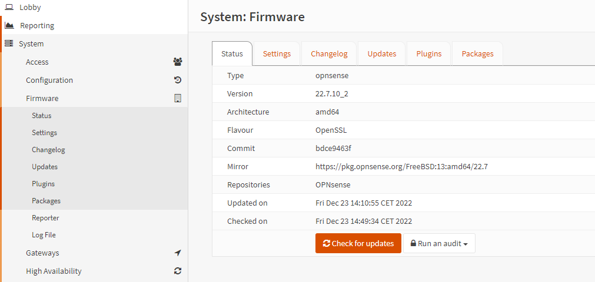

### How to Setup KPN on OPNsense with seperate TV VLAN

In this How-To we are going to setup KPN on OPNsense on with iTV on the LAN interface.

### Step. 1

After install pfSense go to

```
System > Firmware > Status
```



Click ```Check for updates``` if there are updates available scroll down the page and install them.

### Step. 2

Go to

```
Interfaces > Other Types > VLAN
```


Create 2 VLANs on your WAN interface:
```VLAN6```
```VLAN4```