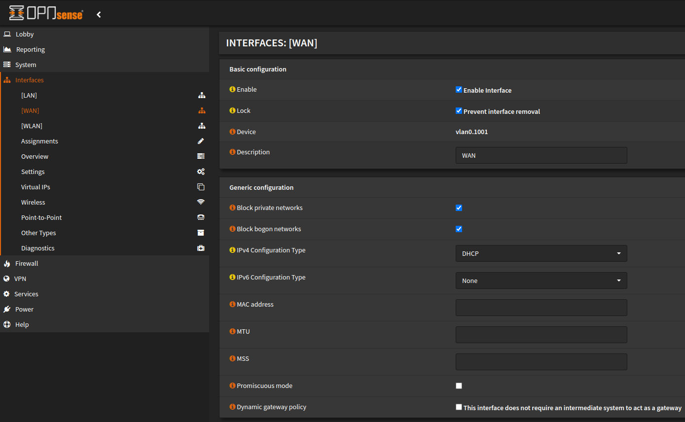

### How to Setup Online.nl on OPNsense [Internet only]

In this How-To we are going to setup Online.nl on OPNsense

### Step. 1

Go to

```
Interfaces > Other Types > VLAN
```
Create VLAN 1001 on your WAN interface


### Step. 2
Go to

```
Interfaces > Assignments
```


Change the WAN interface to ```Parent: [wan-interface], Tag: 1001```

Save now.

### Step. 3
Go to

```
Interfaces > WAN
```



**Generic configuration**

Set IPv4 Configuration Type: ```DHCP```

Set IPv6 Configuration Type: ```DHCPv6```
Or None. So far i have not seen IPv6 on this connection.

### Step. 4
Go fast!
