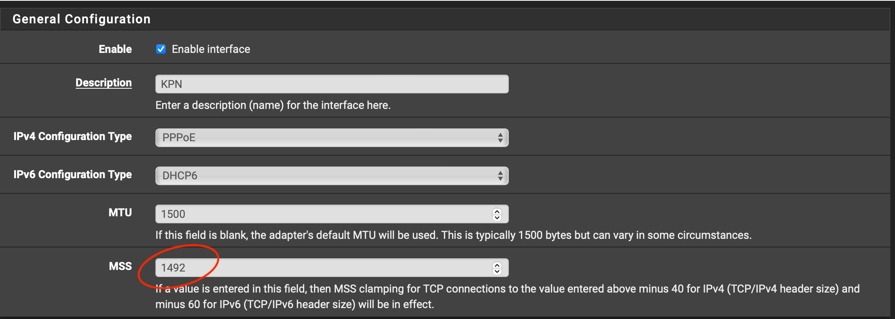
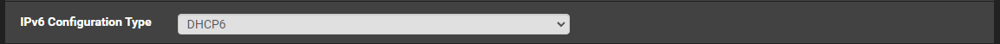
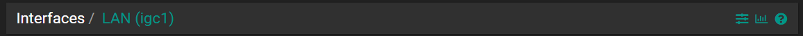
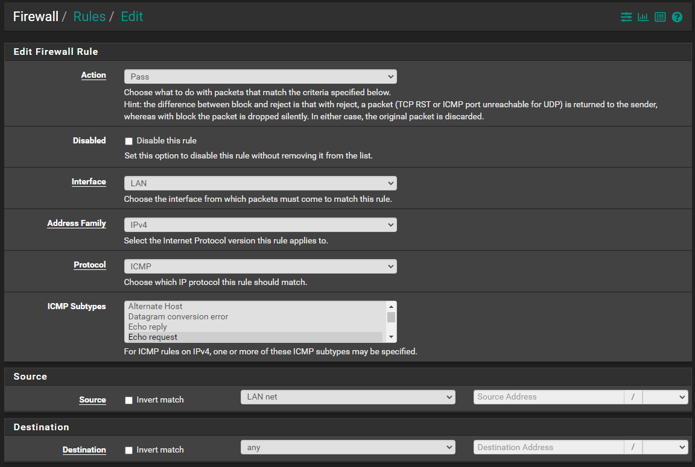
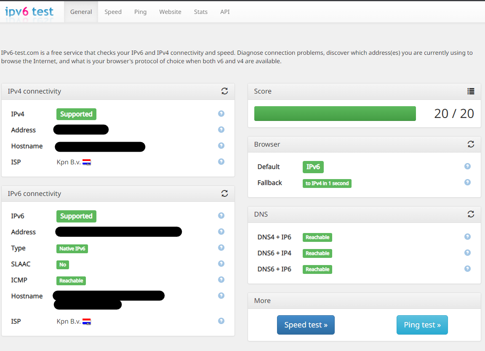

### How to Setup KPN IPv6 in pfSense

In this How-To we are going to setup IPv6 for KPN in pfSense

### Step. 1

In order to do this follow you should have followed one of the pfSense guides about Internet & iTV

* [pfSense without separate TV VLAN](pfSense-without-vlan.md)
* [pfSense with seperate TV VLAN](pfSense-with-vlan.md)

Go to

```
Interface > WAN
```




Make sure the MTU size is set to 1500 and the MSS is set to 1492.




Set IPv6 Configuration Type: ```DHCP6```


Set Use IPv4 connectivity as parent interface: ```True```

Set Request only an IPv6 prefix: ```True```

Set DHCPv6 Prefix Delegation size: ```48```

Set Send IPv6 prefix hint: ```True```

Set Do not wait for a RA: ```True```

### Step. 2

Go to

```
Interface > LAN
```




Set IPv6 Configuration Type: ```Track Interface```


Set IPv6 Interface: ```WAN```

Set IPv6 Prefix ID: ```1``` (* can be something between (hexadecimal from 0 to ffff))

### Step. 3

Go to

```
Services > DHCPv6 & RA
```

Go to tab
```
LAN > DHCPv6 Server
```


Set DHCPv6 Server: ```True```

Set Range: ```::1000 / ::2000```

Set Prefix Delegation Size: ```56```

Go to tab
```
LAN > Router Advertisements
```


Set Router mode: ```Assisted - RA Flags [managed, other stateful], Prefix Flags [onlink, auto, router]```

### Step. 4

Go to

```
Firewall > Rules > WAN
```


IPv4 ICMP

Set Address Family: ```IPv4```

Set Protocol: ```ICMP```

Set ICMP Subtypes: ```Echo request```

Set Source: ```any```

Set Destination: ```any```


IPv6 Link-Local

Set Address Family: ```IPv6```

Set Protocol: ```UDP```

Set Source: ```Network``` ```fe80::/10```

Set Destination: ```Any```

Set Destination Port Range: ```Any``` ```Any```


IPv6 ICMP

Set Address Family: ```IPv6```

Set Protocol: ```ICMP```

Set ICMP Subtypes: ```Echo request```

Set Source: ```any```

Set Destination: ```any```

### Step. 5

```
Firewall > Rules > LAN
```




IPv4 ICMP

Set Address Family: ```IPv4```

Set Protocol: ```ICMP```

Set ICMP Subtypes: ```Echo request```

Set Source: ```LAN net```

Set Destination: ```any```


IPv6 ICMP

Set Address Family: ```IPv6```

Set Protocol: ```ICMP```

Set ICMP Subtypes: ```Echo request```

Set Source: ```LAN net```

Set Destination: ```any```

### Step. 6

Reboot your router now!

Go to

```
Diagnostics > Reboot
```

### Step. 7

Now IPv6 should be configured for your pfSense.

You can check if its working at one of the following sites.

* [ipv6-test.com](https://ipv6-test.com/)
* [test-ipv6.com](https://test-ipv6.com/)
* [ipv6test.google.com](https://ipv6test.google.com/)



If you are getting 18/20 and ICMP says filtered on ipv6-test.com try to visit it on your mobile.

Windows Defender Firewall is the issue, you can disable Windows Defender Firewall to test it.

```
But we don't recommend to keep your Windows Defender Firewall disabled!!!
```
