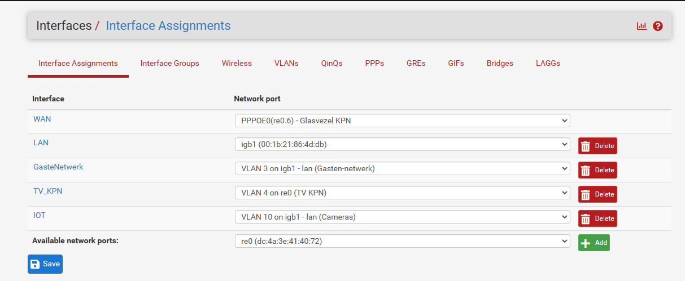
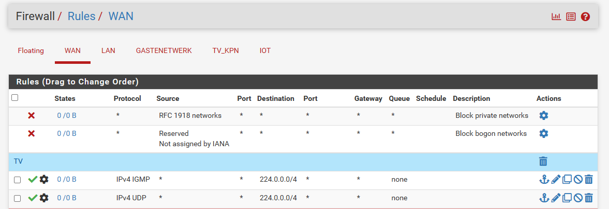
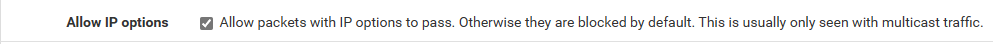

### How to set up KPN on pfSense without a seperate TV VLAN

After installing pfSense go to:

```
Interface > Assignments > Vlans
```


Create 2 VLANs *vlan6* & *vlan4* on your WAN interface, then go to:

```
Interface > Assignments > PPP
```

Add a new interface and link it to you WAN port.


Then go to: 

```
Interface > Assignments 
```


This is where you set your PPPOE interface as WAN.  
Set Lan as your lan interface and assign a new interface (Vlan4) to KPN tv

Then go to:

```
Interface > TV_KPN
```
set this at _Send options_
```
dhcp-class-identifier "IPTV_RG"
```
and set this at _Request options_
```
subnet-mask,routers,classless-routes
```

Save the settings and go to:

```
Services > IGMP Proxy
```


Enable IGMP

Add an upstream and downstream proxy. The upstream proxy takes the default route: 0.0.0.0/0 (or on pfSense: 0.0.0.0/1 , 128.0.0.0/1)
Add your LAN network to the downstream proxy. 

Then go to:

```
Services > DHCP Server > LAN
```

Scroll to the bottom and open *Additional BOOTP/DHCP Options*
and enter the following lines


In this example is the broadcast adress 10.0.0.255 set here your own broadcast address

Then go to:

```
Firewall > NAT > Outbound
```


And add the line above under mappings

Then go to

```
Firewall > Rules > WAN
```

Add the following lines



On the IPv4 IGMP rule enable the following line.
_Allow IP options_


Then go to:

```
Firewall Rules LAN
```

and add the following lines


On the IPv4 IGMP rule _Allow IP options_


_The 213.75.112.0/21 is the ip/subnet from kpn itv_

Then go to:

```
Firewall > Rules > TV_KPN
```

And add the following lines


On the IPv4 IGMP rule _Allow IP options_

