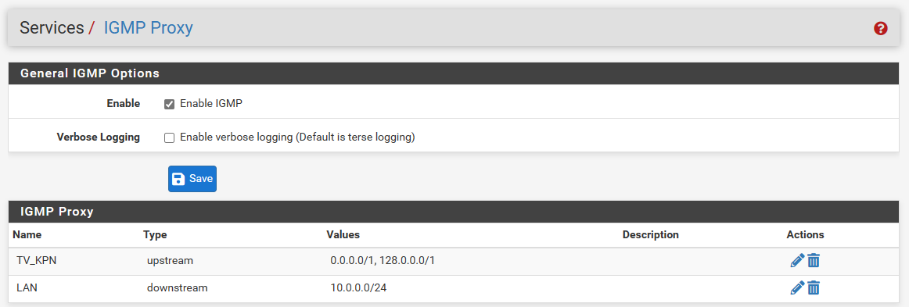
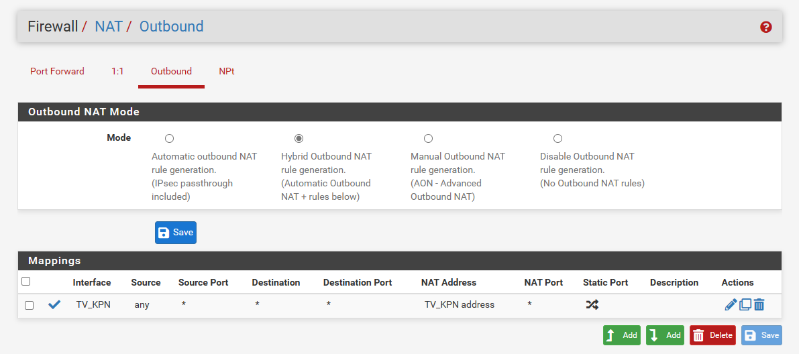
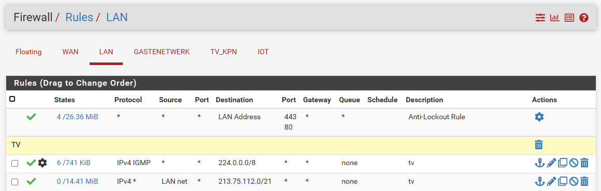
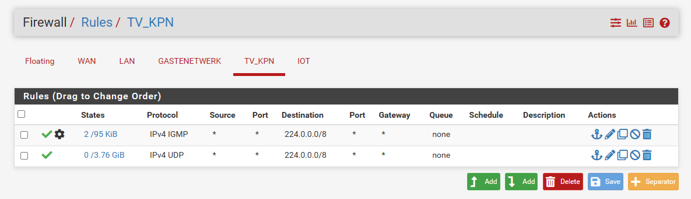

#### How to Setup KPN on pfSense without seperate TV VLAN

After install pfSense go to

```
Interface > Assignments > Vlans
```


Create 2 Vlans *vlan6* & *Vlan4* on your WAN interface.

Than go to

```
Interface > Assignments > PPP
```

Add a new interface and link it to you WAN port


Than go to 

```
Interface > Assignments 
```


Set here your WAN to you PPP interface.  
Set Lan to your lan interface / port.  
And assign a new interface Vlan4 for kpn tv

Than go to

```
Interface > TV_KPN
```
and set this by _Send options_
```
dhcp-class-identifier "IPTV_RG"
```
and set this by _Request options_
```
subnet-mask,routers,classless-routes
```

Save the settings.

Than to go

```
Services > IGMP Proxy
```



Enable IGMP

add an upstream and downstream.
Upstream takes the default route. 0.0.0.0/0 or on pfSense 0.0.0.0/1 , 128.0.0.0/1
And by downstream add your lan ip and subnet

Than go to

```
Services > DHCP Server > LAN
```

Scroll to the bottom and open *Additional BOOTP/DHCP Options*
and enter the following lines


In this example is the broadcast adress 10.0.0.255 set here your own broadcast address

Than go to

```
Firewall > NAT > Outbound
```



And add the line above under mappings

Than go to

```
Firewall > Rules > WAN
```

Add the following lines


On the IPv4 IGMP rule enable the following line.
_Allow IP options_


Than go to

```
Firewall Rules LAN
```

and add the following lines



On the IPv4 IGMP rule _Allow IP options_


_The 213.75.112.0/21 is the ip/subnet from kpn itv_

Than go to

```
Firewall > Rules > TV_KPN
```

And add the following lines


On the IPv4 IGMP rule _Allow IP options_

